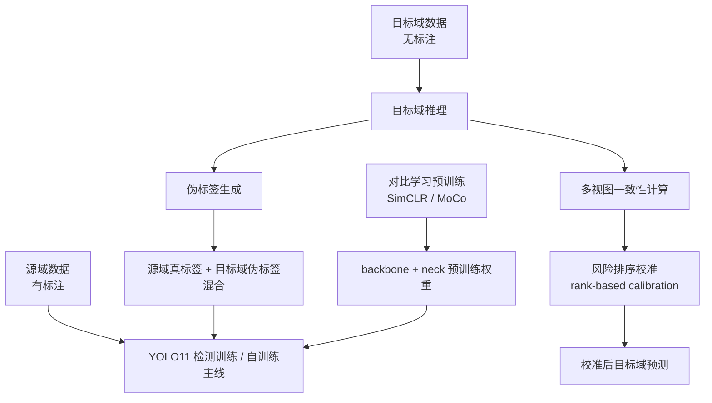

# YOLO11 无监督域适应目标检测项目总说明

## 1. 项目定位

本项目目录名虽然仍是 `yolov7-main`，但实际训练主线已经切换为 **YOLO11 + 无监督域适应目标检测**。

项目目标是：

- 在**源域**使用有标注数据训练检测器；
- 在**目标域**只有无标注图像的条件下，通过自训练与置信度校准提升目标域检测性能；
- 研究哪些增强模块在目标域上真正有效。

当前最可信的论文主线不是“提出一个新的 SOTA DAOD 框架”，而是：

- 以 **YOLO11 自训练** 为 baseline；
- 以 **rank-based test-time calibration** 作为主创新；
- 其余方法作为消融或负结果分析。

---

## 2. 项目主流程

项目包含两条主线：

1. **对比学习预训练**
2. **目标域自训练与测试时校准**

### 2.1 总体流程图

### 2.2 核心脚本

- `train_contrastive.py`
  - 对比学习预训练入口
- `self_training.py`
  - 自训练主入口
- `test_time_calibration.py`
  - 测试时校准独立入口
- `run_paper_experiments.py`
  - 论文实验批量运行入口

---

## 3. 数学建模

下面给出当前这篇论文最应该使用的建模方式。这里不再使用反引号包公式，而使用标准 LaTeX 公式写法。

### 3.1 问题定义

设源域有标注数据为：

$$
\mathcal{D}_s = \{(x_i^s, y_i^s)\}_{i=1}^{N_s}
$$

设目标域无标注数据为：

$$
\mathcal{D}_t = \{x_j^t\}_{j=1}^{N_t}
$$

其中：

- $x_i^s$ 表示源域图像；
- $y_i^s$ 表示源域检测标注；
- $x_j^t$ 表示目标域无标注图像。

设检测器为：

$$
f_{\theta}(x) = \{(b_k, p_k, c_k)\}_{k=1}^{M}
$$

其中：

- $b_k$ 为预测框；
- $p_k$ 为置信度；
- $c_k$ 为预测类别；
- $\theta$ 为模型参数。

目标是学习参数 $\theta$，使模型在目标域上获得更好的检测性能。

### 3.2 baseline：YOLO11 自训练

源域监督损失写为：

$$
\mathcal{L}_s(\theta) = \mathcal{L}_{det}(f_{\theta}(x^s), y^s)
$$

对目标域图像生成伪标签：

$$
\hat{y}^t = \mathcal{P}(f_{\theta}(x^t))
$$

其中 $\mathcal{P}(\cdot)$ 表示伪标签生成算子。

于是混合训练目标为：

$$
\mathcal{L}(\theta) = \mathcal{L}_s(\theta) + \lambda_t \mathcal{L}_p(\theta)
$$

其中

$$
\mathcal{L}_p(\theta) = \mathcal{L}_{det}(f_{\theta}(x^t), \hat{y}^t)
$$

这就是当前项目的 baseline，本质上是：

- 源域监督训练；
- 目标域生成伪标签；
- 源域真标签与目标域伪标签混合微调。

### 3.3 多视图一致性校准

对于目标域图像 $x$，定义一组轻量视图：

$$
\mathcal{V}(x) = \{v_0(x), v_1(x), \dots, v_K(x)\}
$$

其中：

- $v_0(x)=x$；
- 其余视图可为水平翻转、亮度变化、对比度变化等。

在每个视图上进行检测：

$$
f_{\theta}(v_k(x)) = \{d_m^{(k)}\}
$$

对原图上的某个检测框 $d$，在其他视图中寻找映射回原坐标系后的匹配框 $d_k^\ast$。

### 3.4 一致性分数

定义第 $k$ 个视图的匹配分数：

$$
s_k(d) = 0.5 \cdot \operatorname{IoU}(d, d_k^\ast) + 0.5 \cdot \left(1 - |p(d) - p(d_k^\ast)|\right)
$$

则总体一致性分数为：

$$
c(d) = \frac{1}{K} \sum_{k=1}^{K} s_k(d)
$$

解释：

- $c(d)$ 越高，说明该检测在轻微扰动下越稳定；
- $c(d)$ 越低，说明该检测更可能是不可靠检测。

### 3.5 风险分数

当前项目采用的风险定义为：

$$
r(d) = p(d)\bigl(1-c(d)\bigr)
$$

解释：

- 高置信度、低一致性的框最危险；
- 低置信度框即使不稳定，对结果影响通常较小；
- 高置信度且高一致性的框相对可信。

### 3.6 排序式测试时校准

对所有检测框按 $r(d)$ 降序排序，选出高风险集合 $\mathcal{R}_{\alpha}$。

当前主方法的校准规则为：

$$
p'(d)=
\begin{cases}
p(d)\bigl(\alpha + \beta c(d)\bigr), & d \in \mathcal{R}_{\alpha} \text{ 且 } c(d) < \tau_c \\
p(d), & \text{其他情况}
\end{cases}
$$

其中：

- $\alpha$ 是基础缩放系数；
- $\beta$ 是一致性权重；
- $\tau_c$ 是一致性阈值。

这与全局 temperature scaling 不同。它**不是改所有框**，而是只下调“高风险且不稳定”的框。

### 3.7 校准引导的伪标签筛选

一个扩展版本会在伪标签生成时联合使用校准信息。定义保留指示函数：

$$
g(d) = \mathbb{1}[p'(d)\ge \tau_p] \cdot \mathbb{1}[c(d)\ge \tau_{cons}] \cdot \mathbb{1}[r(d)\le \tau_{risk}]
$$

则目标域伪标签集合为：

$$
\hat{y}^t = \{d \mid g(d)=1\}
$$

实验表明，这个版本是稳定的，但没有超过简单的 `rank_calibration`。

### 3.8 自适应伪标签阈值

另一个扩展版本是对低一致性检测提高阈值：

$$
\tau_{eff}(d) = \tau_0 + \gamma \max(0, c_{target} - c(d))
$$

其中：

- $\tau_0$ 是基础阈值；
- $c_{target}$ 是目标一致性水平；
- $\gamma$ 是惩罚尺度。

随后按下式保留伪标签：

$$
g(d) = \mathbb{1}[p'(d)\ge \tau_{eff}(d)]
$$

这个版本同样没有超过 `rank_calibration`。

---

## 4. 当前创新模块与状态

本项目已经实现过多条创新线，但它们的有效性不同。

### 4.1 当前建议保留为主线的方法

#### 1）Rank-Based Test-Time Calibration

这是当前最值得保留的核心方法。

思路：

- 对目标域图像做多视图推理；
- 计算每个检测框的一致性分数；
- 通过风险分数识别“高置信但不稳定”的危险框；
- 仅对这些框做置信度下调。

特点：

- 成本低；
- 不需要重写训练框架；
- 在 `SIM10K -> Cityscapes` 上给出当前项目最好的目标域结果；
- calibration 指标也有稳定小幅改善。

#### 2）Calibration-Guided Pseudo Labeling

这是 `rank_calibration` 的扩展版。

思路：

- 用校准后的置信度、一致性和风险共同筛选伪标签。

状态：

- 稳定；
- 没有比 `rank_calibration` 更强；
- 适合作为消融。

#### 3）Adaptive Pseudo Thresholding

思路：

- 对一致性差的检测提高伪标签阈值；
- 对一致性高的检测保持较低阈值。

状态：

- 稳定；
- 与 `rank_calibration` 基本打平；
- 可作为消融。

### 4.2 已实现但当前不建议主打的方法

#### 1）Progressive Pseudo Refinement

思路：

- 跨轮次比较当前预测与上一轮预测；
- 用一致性筛除不稳定伪标签。

状态：

- 在 source 指标上有时表现不错；
- 但在目标域 AP 上不稳定；
- 当前不应作为主贡献。

#### 2）Domain-Aware Contrastive Pretraining

思路：

- 在对比学习阶段加入域感知损失；
- 希望学到更具域不变性的表示。

状态：

- source 指标不一定差；
- 但在目标域 AP 上整体较差；
- 当前版本不适合作为论文主线。

### 4.3 已实现但建议淘汰的方法

#### 1）CBAM Pretraining

思路：

- 在对比预训练的特征层加入注意力模块。

状态：

- 成本增加；
- 目标域 AP 明显较差；
- 不建议继续投入。

#### 2）LayerLock-Inspired Progressive Freezing

思路：

- 借鉴 LayerLock 的渐进式冻结思想；
- 在不同阶段冻结浅层特征并迁移对比目标层级。

状态：

- 当前实现没有带来正向目标域收益；
- 不建议作为主卖点。

#### 3）Iteration-Level EMA Teacher

思路：

- 每轮自训练后用学生模型更新教师模型；
- 下轮用教师模型生成伪标签。

状态：

- 当前实现明显失败；
- 与真正 step-level EMA teacher 仍有差距；
- 当前版本应淘汰。

---

## 5. 实验数据集与任务

当前正式 benchmark 有两组：

1. **Cityscapes $\rightarrow$ Foggy Cityscapes**
2. **SIM10K $\rightarrow$ Cityscapes**

其中：

- `Cityscapes -> Foggy` 代表跨天气迁移；
- `SIM10K -> Cityscapes` 代表合成到真实迁移。

---

## 6. 当前正式实验结果

以下结果以**目标域 AP**为主，因为 source 验证 AP 在该项目中已经证明会误导方法选择。

### 6.1 主结果

| Benchmark | Method | Target AP50 | Target AP50-95 | $\Delta$ECE | $\Delta$NLL | $\Delta$Brier |
| --- | --- | ---: | ---: | ---: | ---: | ---: |
| Cityscapes $\rightarrow$ Foggy | baseline | 0.1433 | 0.0871 | - | - | - |
| Cityscapes $\rightarrow$ Foggy | rank_calibration | 0.1418 | 0.0873 | -0.0000038 | -0.0000248 | -0.0000110 |
| SIM10K $\rightarrow$ Cityscapes | baseline | 0.3246 | 0.1870 | - | - | - |
| SIM10K $\rightarrow$ Cityscapes | rank_calibration | 0.3715 | 0.2117 | -0.0000184 | -0.0000462 | -0.0000134 |

结论：

- 在 `SIM10K -> Cityscapes` 上，`rank_calibration` 是当前最优方法；
- 在 `Cityscapes -> Foggy` 上，`rank_calibration` 与 baseline 基本打平；
- 因此当前最合理的论文表述是“低成本、稳定的目标域校准改进”，而不是“全面优于 baseline 的新框架”。

### 6.2 消融结果

#### SIM10K $\rightarrow$ Cityscapes

| Method | Target AP50 | Target AP50-95 | 结论 |
| --- | ---: | ---: | --- |
| baseline | 0.3246 | 0.1870 | 对照组 |
| rank_calibration | 0.3715 | 0.2117 | 当前最佳 |
| calibration_guided_pseudo | 0.3715 | 0.2117 | 稳定，但未超过主方法 |
| adaptive_pseudo_threshold | 0.3715 | 0.2117 | 稳定，但未超过主方法 |
| progressive_pseudo | 0.2833 | 0.1739 | 不如 baseline |
| domain_loss_pretrain | 0.0208 | 0.0127 | 崩溃 |
| cbam_pretrain | 0.0153 | 0.0104 | 崩溃 |
| layerlock_pretrain | 0.0035 | 0.0017 | 崩溃 |
| ema_teacher | 0.0062 | 0.0020 | 当前实现不可用 |

#### Cityscapes $\rightarrow$ Foggy

| Method | Target AP50 | Target AP50-95 | 结论 |
| --- | ---: | ---: | --- |
| baseline | 0.1433 | 0.0871 | 当前最佳 |
| rank_calibration | 0.1418 | 0.0873 | 与 baseline 基本打平 |
| progressive_pseudo | 0.1374 | 0.0834 | 略差 |
| cbam_pretrain | 0.0516 | 0.0302 | 很差 |
| domain_loss_pretrain | 0.0345 | 0.0192 | 很差 |
| layerlock_pretrain | 0.0160 | 0.0091 | 很差 |

---

## 7. 与前沿方法的差距

用 `SOCCER` 这类主流 DAOD 文献做参照，当前项目仍有明显差距。

| Benchmark | 本项目最佳 AP50 | 参考方法 AP50 | 差距 |
| --- | ---: | ---: | ---: |
| Cityscapes $\rightarrow$ Foggy | 0.1433 | 0.511 | 0.3677 |
| SIM10K $\rightarrow$ Cityscapes | 0.3715 | 0.638 | 0.2665 |

因此，当前结论应当非常克制：

- 现在还不具备冲击强顶会主会的结果强度；
- 但已经形成了一条清楚、可复现、可写成文章的“小而实”的方法线；
- 这条线的核心价值在于：
  - 校准；
  - 目标域可靠性分析；
  - 负结果清晰；
  - 工程实现完整。

---

## 8. 当前最合理的论文叙事

### 8.1 推荐标题方向

可用的题目方向例如：

- **面向 YOLO11 自训练无监督域适应检测的排序式测试时置信度校准**
- **基于风险排序的测试时校准在无监督域适应目标检测中的应用**

### 8.2 推荐贡献点

当前最适合写的贡献点有三条：

1. 提出一个面向 YOLO11 自训练域适应检测的 **rank-based test-time calibration** 模块；
2. 在 `SIM10K -> Cityscapes` 上证明该方法能同时改善目标域检测性能与置信度可靠性；
3. 对多种伪标签增强和对比预训练变体进行系统分析，说明复杂模块并不一定优于简单校准基线。

### 8.3 不建议宣称的内容

当前不应宣称：

- 提出了新的强 SOTA DAOD 框架；
- 当前对比学习预训练是有效的；
- 当前 LayerLock、CBAM、EMA teacher 在本项目上有效。

---

## 9. 当前推荐保留的文件

如果后续要继续清理文档，建议重点保留下面几类：

- 本文件：`项目总说明_中文版.md`
- 论文结果：`PAPER_RESULTS.md`
- 主线摘要：`PAPER_MAINLINE.md`
- 论文草稿：`PAPER_DRAFT.md`
- 数据集说明：`DATASET_SETUP.md`

其余英文中间文档可以在确认无用后再删。

---

## 10. 一句话结论

当前项目最有价值的成果不是“做出了新的通用 DAOD 框架”，而是：

> 在 YOLO11 自训练无监督域适应检测中，构建了一条完整、可复现、带数学解释的 **rank-based test-time calibration** 方法线，并证明它是当前所有已测变体中最稳妥的目标域改进方案。
